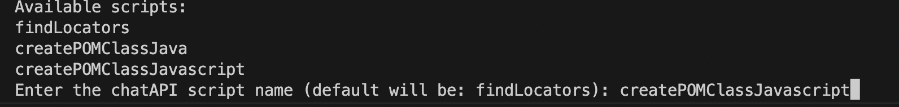
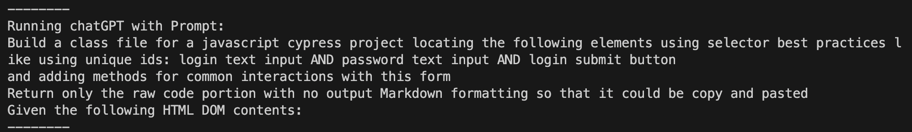
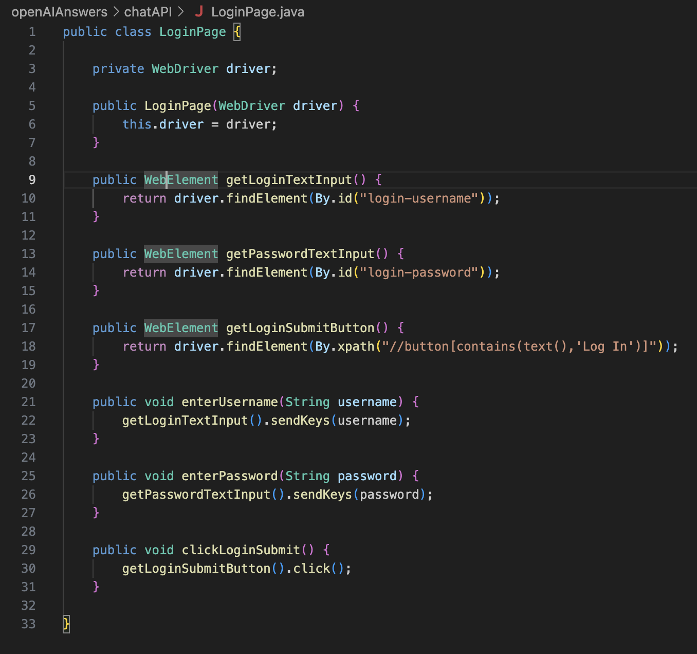

## Requirements:
Follow the setup instructions in the file: `SETUP_INSTRUCTIONS.md`

## About:

The main goal of this project is to assess the feasibility of using AI and natural language instructions using text prompts in order to generate helpers for common automation tasks that could be accelerated with the use of AI.

This POC works with a simple script using an extensible configuration file,
allowing to implement more POCs by creating more prompts to be tested and saved after
confirming to work as expected.

## Project structure:

Inside `config.json` there are configuration entries to be used with the openAI completions API
each entry under the `chatAPI` looks as follows:

```
"findLocators": {
    "DOMsourcePath": "./sampleDOMfiles/reddit_login_reduced_html.html",
    "promptPath": "./prompts/chatAPIfindLocators.txt",
    "systemContent": "You are an experienced SET engineer with over 10 years of experience that follows the best practices and standards",
    "model": "gpt-3.5-turbo",
    "outputPath": "./openAIAnswers/chatAPI/findLocators.txt"
},
````

`DOMsourcePath`: file path that contains the DOM contents to work with

`promptPath`: file path that contains the prompt to work with for this configuration


`systemContent`: string defining the system role for openAI

`model`: model to be used during the execution

`outputPath`: filePath where openAI response content will be writen to

Each prompt will concatenate the text content of the `promptPath` followed 
by the content of the `DOMsourcePath`


### Project scrutcture:

`openAIAnswers/chatAPI` directory that contains some sample output responses, this is just a convention, you can specify the any output path in the `config.json` file.

`prompts` directory that contains some prompt examples , this is just a convention, you can specify  any file path in the `config.json` file for each entry.

`sampleDOMfiles` directory that contains some DOM content , this is just a convention, you can specify  any file path in the `config.json` file for each entry.

## How to run

after following the `SETUP_INSTRUCTIONS.md` file
run: `python3 src/chatAPI/chatAPIscript.py`
the available scripts will be listed
copy and paste any of the entries that are listed:

you'll see the prompt used for that script

and once the answer from OpenAI API request is processed, it will be written to the specified output file path.

## Troubleshooting

if you have trouble with the OpenAPI env var, try setting it in your terminal session with the following command and running the script again:

```
export OPENAI_API_KEY="your_api_key"
```

## Results:

Example Results from running POM `createPOMClassJava`and `createPOMClassJavascript` scripts:


 
## Adding new scripts:

- Copy one of the entries from  `config.json` and add it at in `config.json` and save edit.
- Use a new name for the new entry


## NOTE on DOM input file:

While testing , given the size of an entire page the openAI API request fails with
an error about the amount of tokens used in the request.
`Request too large for gpt-3.5-turbo`
`Request too large for gpt-4o`

There's a sample script in the `config.json` to demonstrate this named: `findLocatorsFailExample`

Due to this the sample for testing this POC was the DOM of the area of interest.

For getting more DOM files navigate to any web page of interest and inspect the area 
to be used by the openAI request, then right click and select copy element like the example below:


## Helpers built using OpenAI PROMPT API:

- `Request AI to find locator strings by providing a file containing the text DOM content`

  - Common use case:

    - Locators break given some UI updates in the application
    - UI faces updates and user requests previously existing elements and new ones
  - How to use:
    - Anyone, not only QAs, can reach for the dom content and feed it to the AI and request the desired elements' locator strings
  - Input:
    - Dom content
    - Prompt specifying the desired elements
  - Output:
    - list of elements and the found locator strings by AI

- `Request AI to build POM classes files by providing a file containing the text DOM content`

  - Common use case:
    - An existing page is implemented but not covered in the automation framework
  - How to use:
    - Anyone, not only QAs, can reach for the dom content to be used with this tool, 
  - Input:
    - Dom content
    - Prompt specifying the desired elements to be mapped and referencing the framework to write the POM class
  - Output:
    - A POM class implementation in a text file in the given format for the specified given framework 


